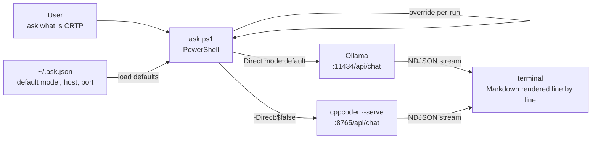
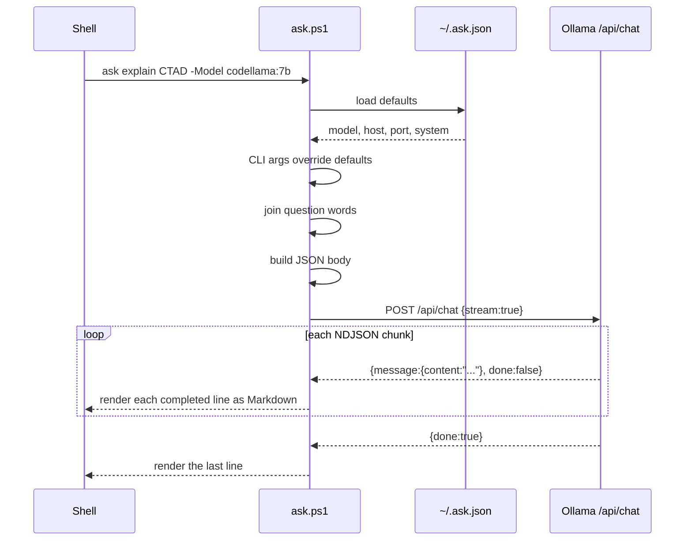
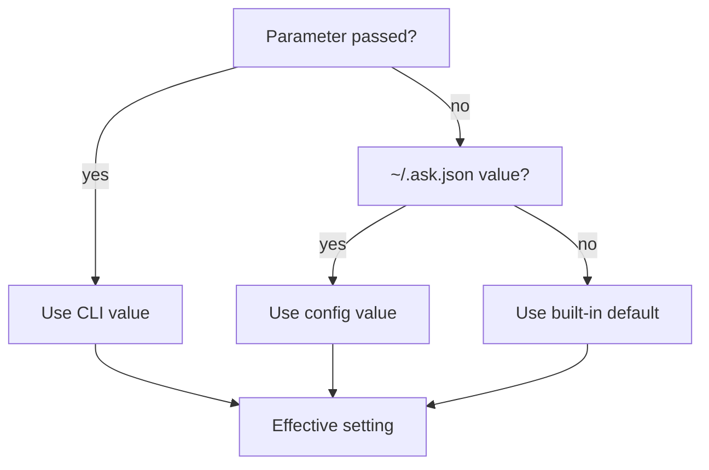
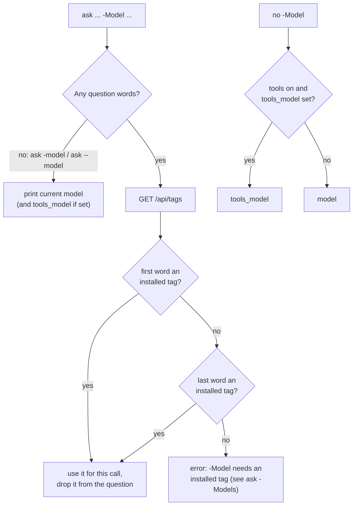
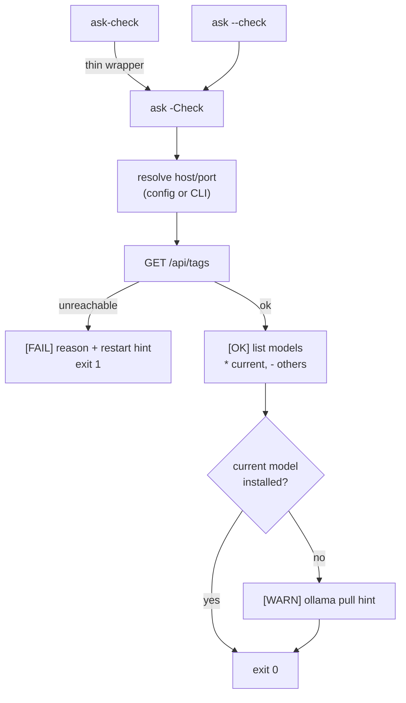

# CppAsk

A PowerShell CLI for asking your local LLM a question from any terminal, without quotes, without a browser, without friction. Replies stream in as rendered Markdown; optional tools let the model fetch pages, read files and (with your OK) run commands.

Built on top of [CppLocalLlmCodeAssist](https://github.com/cschladetsch/CppLocalLlmCodeAssist) and [Ollama](https://ollama.com).

## Demo


📖 [Docs & diagrams](https://cschladetsch.github.io/CppAsk/)

```powershell
ask what is the rule of five in C++23
ask explain CRTP -Model qwen2.5-coder:7b
ask -model                  # which model am I using?
ask-check                   # is Ollama up? (* marks the current model)
ask -SetModel dolphin-8b:latest
```

---

## How it works



### Request lifecycle



### Config resolution



---

## Requirements

- PowerShell 7+
- [Ollama](https://ollama.com) running locally
- At least one model pulled: `ollama pull dolphin-8b:latest`

---

## Install

```powershell
git clone https://github.com/cschladetsch/CppAsk
cd CppAsk
.\install.ps1
```

The installer:

1. Copies `ask.ps1`, `ask-tools.ps1` and `ask-check.ps1` to `~/bin` (or `-Destination` of your choice)
2. Adds `~/bin` to your user `PATH` permanently
3. Adds a global `ask` function and alias to `$PROFILE`
4. Queries `ollama list` and prompts for config values
5. Writes `~/.ask.json` (keeping any settings already there)
6. Makes `ask` available in the current session immediately

```
  ask installer
  ─────────────────────────────────────────

  Available Ollama models:
    dolphin-8b:latest
    qwen2.5-coder:7b
    codellama:7b
    ...

  Default model       [dolphin-8b:latest]:
  Ollama host         [127.0.0.1]:
  Ollama port         [11434]:
  cppcoder port       [8765]:
  System prompt       []:
```

---

## Usage

```powershell
# No quotes needed
ask what is the rule of five in C++23
ask explain brace elision
ask what does PatchApplier do

# Override model for one run (the tag can go before or after the question)
ask explain CRTP -Model qwen2.5-coder:7b
ask -Model codellama:7b write a merge sort in Rust

# Show the current model
ask -model
ask --model

# Is the server up, and which models are installed?
ask-check
ask --check

# Pipe a question in
"why does CTAD fail here?" | ask

# Add a system prompt for one run
ask summarise this -System "You are a terse technical editor."

# Change the persistent default model
ask -SetModel dolphin-8b:latest
ask -SetModel qwen2.5-coder:7b

# Route via cppcoder --serve instead of Ollama directly
ask what does ResearchEngine do -Direct:$false

# Collect full reply before printing, or print it as plain text
ask explain templates -NoStream
ask explain templates -NoColor

# Open a URL in your browser (no model involved)
ask br old.reddit.com
```

### Quoting

Quotes are optional, but PowerShell parses the words before `ask` sees them.
Quote the question (single quotes are safest) when it contains:

| Character        | What PowerShell does with it               |
|------------------|--------------------------------------------|
| `'` or `"`       | starts a string, so `what's` breaks        |
| `#`              | starts a comment; the rest is dropped      |
| `$x`, `(...)`    | evaluated before `ask` sees them           |
| `\|` `;` `&`      | ends the command or pipes it elsewhere     |
| `<` `>`          | redirection                                |

```powershell
ask 'what''s the difference between #pragma once and include guards'
```

---

## Parameters

| Parameter     | Default              | Description                                              |
|---------------|----------------------|----------------------------------------------------------|
| `Question`    | *(required)*         | Words to ask -- no quotes needed, joined automatically   |
| `-Model`      | from config          | Alone: show the current model. With an installed tag before or after the question: use it for this call |
| `--model`     |                      | Show the current model, then exit                        |
| `-OllamaHost` | `127.0.0.1`          | Ollama hostname                                          |
| `-Port`       | `11434`              | Port -- `11434` for Ollama direct, `8765` for cppcoder   |
| `-Direct`     | `$true`              | Talk straight to Ollama; `$false` routes via cppcoder    |
| `-System`     | from config          | System prompt prepended to every request                 |
| `-NoStream`   | off                  | Buffer full reply before printing                        |
| `-NoColor`    | off                  | Plain text, no Markdown rendering                        |
| `-SetModel`   |                      | Save a new default model to config (other keys untouched), then exit |
| `-NewChat`    | off                  | Clear history, then start a fresh thread with this question |
| `-NoHistory`  | off                  | One-shot -- don't read or write history for this call     |
| `-ClearHistory` |                    | Wipe history and exit, without asking anything            |
| `-v`, `--verbose` | off        | Ask for a thorough explanation with examples              |
| `-Tools`      | off                  | Let the model browse, read files and run commands         |
| `-NoTools`    | off                  | Tools (and `br <url>`) off for this call                  |
| `-Help`, `--help`, `-h` |            | Print a usage summary, then exit                          |
| `-Version`, `--version` |            | Print version, commit and install time, then exit         |
| `-Models`     |                      | List models available on the Ollama server, then exit    |
| `-Check`, `--check` |                | Check the server and list models (`*` = current), then exit; same as `ask-check` |

---

## Choosing a model

`ask -model` (or `--model`) prints the model `ask` will use. `-Model <tag>`
switches model for one call; PowerShell leaves the tag as the first or last
word of the question, so `ask` checks those against the installed models and
takes whichever matches. A bare word like `dolphin-8b` also matches
`dolphin-8b:latest`. With tools on and `tools_model` set, that model is used
unless `-Model` says otherwise.



`ask -SetModel <tag>` changes the default permanently.

---

## Checking the server

`ask-check` and `ask --check` are the same command: they check that Ollama
answers, list the installed models with `*` in front of the current one and
`-` in front of the rest, and warn if the current model isn't installed. The
exit code is 1 when the server can't be reached, so it works in scripts.

```
Checking Ollama at http://127.0.0.1:11434...
[OK] Server is running.
Available models:
 * dolphin-8b:latest
 - qwen2.5-coder:7b
 - qwen2.5:7b
```



Server options pass through: `ask-check -Port 11435`.

---

## Config

`~/.ask.json` -- created by the installer, edited by `-SetModel`. Every key
is optional; these are the defaults:

```json
{
    "model":                "dolphin-8b:latest",
    "tools_model":          "",
    "host":                 "127.0.0.1",
    "port_direct":          11434,
    "port_serve":           8765,
    "system":               "",
    "history":              true,
    "history_idle_minutes": 30,
    "tools":                false,
    "confirm_commands":     true,
    "tool_output_chars":    8000
}
```

| Key                    | Meaning                                                        |
|------------------------|----------------------------------------------------------------|
| `model`                | Default model                                                  |
| `tools_model`          | Model used instead when tools are on (empty = use `model`)     |
| `system`               | System prompt for every request (empty = none)                 |
| `history`              | Remember the conversation between calls                        |
| `history_idle_minutes` | Start a fresh thread after this long without a question (0 = never) |
| `tools`                | Tools on by default                                            |
| `confirm_commands`     | Ask y/N before `run_command`                                   |
| `tool_output_chars`    | Cap on tool output passed back to the model                    |

CLI parameters always override config for that run. Model capabilities from
`/api/show` are cached for a day in `~/.ask_model_cache.json`.

---

## Tools

Off by default. With `-Tools` (or `"tools": true` in config) the model can
act, not just talk:

| Tool          | Does                                                   |
|---------------|--------------------------------------------------------|
| `fetch_url`   | Downloads a page and hands its text to the model       |
| `open_url`    | Opens a URL in your default browser                    |
| `read_file`   | Reads a local text file                                |
| `run_command` | Runs a PowerShell command and returns its output       |

```powershell
ask br old.reddit.com                       # opens it in your browser
ask -Tools summarise https://example.com    # fetches and summarises
ask -Tools how much free space is on C:     # runs a command
```

Each tool call is echoed in grey (`> fetch ...`). `run_command` shows the
command and asks `run it? [y/N]` first; with no interactive console it is
refused. Set `"confirm_commands": false` to skip the prompt.

Models that advertise tool support in Ollama use native tool calling; others
(e.g. dolphin) get a text `TOOL {...}` protocol and tend to ignore it, so
`ask` warns and suggests setting `tools_model` to one that supports tools
(e.g. `qwen2.5:7b`). Loosely written calls in the reply text (bare JSON,
`open_url {...}`, a call inside a code fence) are accepted too, but only until
fetched or file content has entered the conversation: after that, only a
native call or an exact `TOOL {...}` reply counts, so a web page can't get a
command run by having the model quote it.

Tool output is capped at `tool_output_chars`. With tools on in config,
`-NoTools` turns them off for one call. The tool loop lives in
`ask-tools.ps1` and is only loaded when tools are on.

---

## Conversation history

By default, `ask` remembers the conversation. Each call appends your question
and the model's reply to `~/.ask_conversation_state.json`, and prepends
everything from that file (capped at the last 20 exchanges) to the next
request -- so follow-ups like `ask and what about X` actually have the prior
turns as context, same as a chat UI.

History goes to `/api/chat` with proper user/assistant roles, so the model
treats earlier questions as already answered and only replies to the new one.
Asking the same question again drops the earlier exchange, so a bad answer
isn't copied. After `history_idle_minutes` (default 30) without a question, the
next one starts a fresh thread, so tomorrow's question doesn't inherit
tonight's context. Set `"history": false` in `~/.ask.json` to turn history off
by default.

```powershell
ask what is CRTP
ask now show an example        # remembers the previous question
ask -NewChat what is CRTP      # starts a fresh thread
ask -NoHistory what is 1+1     # true one-shot, ignores/skips history entirely
ask -ClearHistory              # wipe the thread, don't ask anything
ask -Models                    # list models on the server (* marks the default)
```

---

## Related

- [CppLocalLlmCodeAssist](https://github.com/cschladetsch/CppLocalLlmCodeAssist) -- the full research/edit/chat engine this wraps
- [Ollama](https://ollama.com) -- local model runtime

## License

MIT


