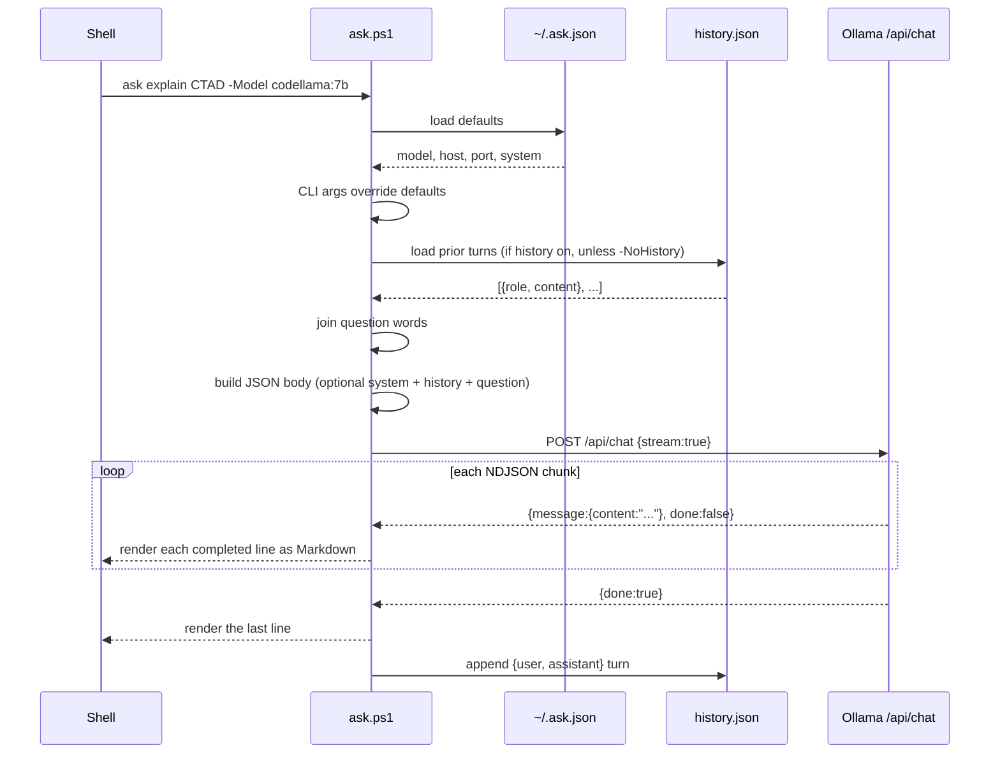
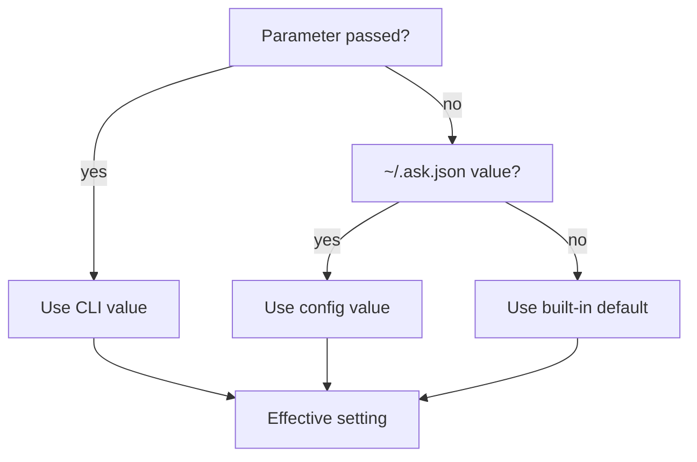
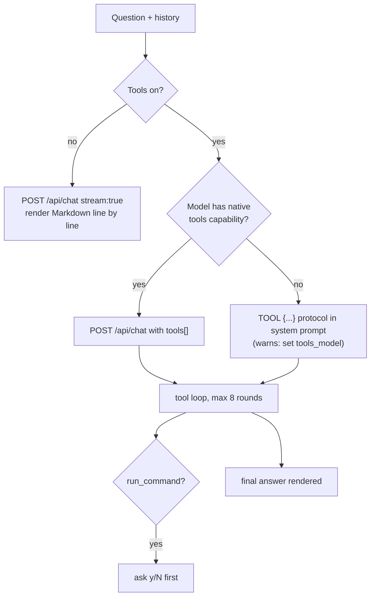
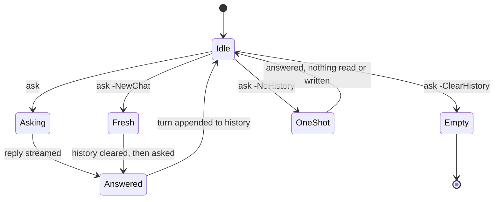
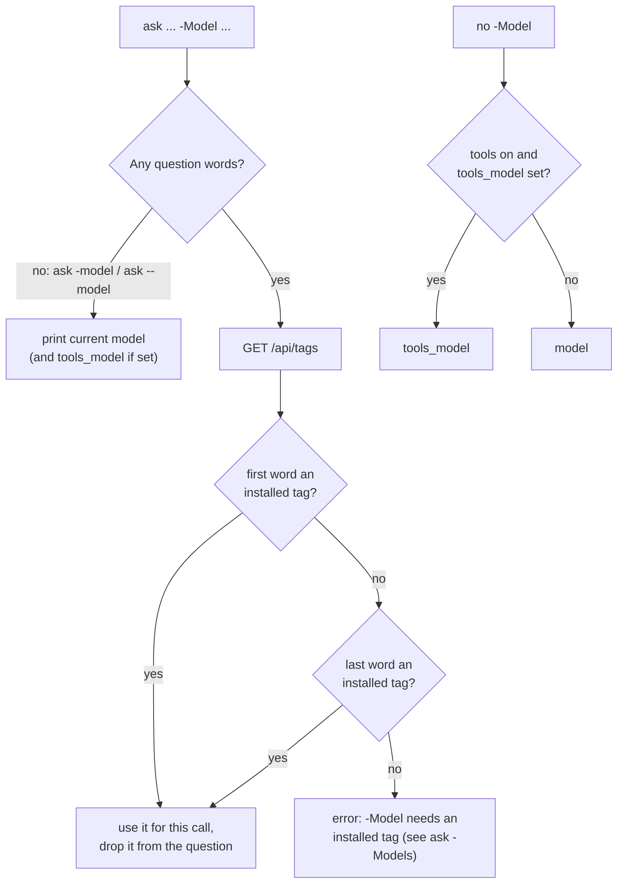
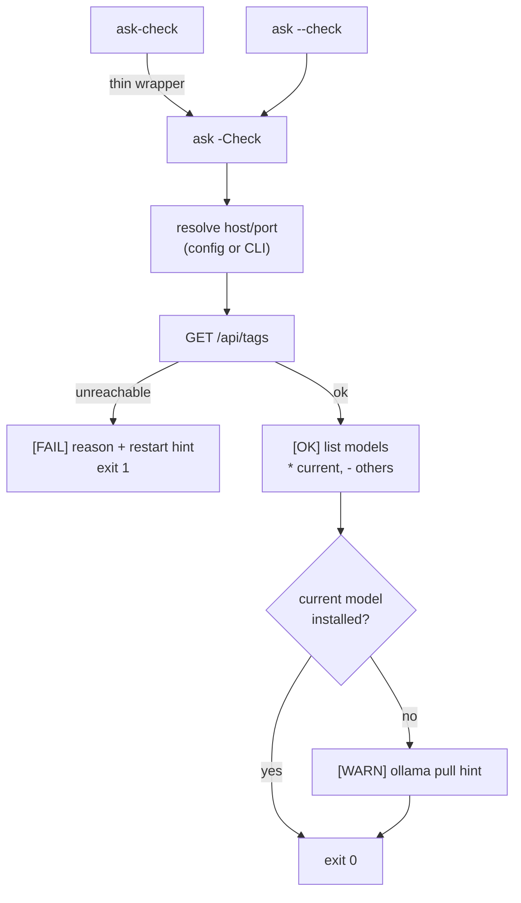
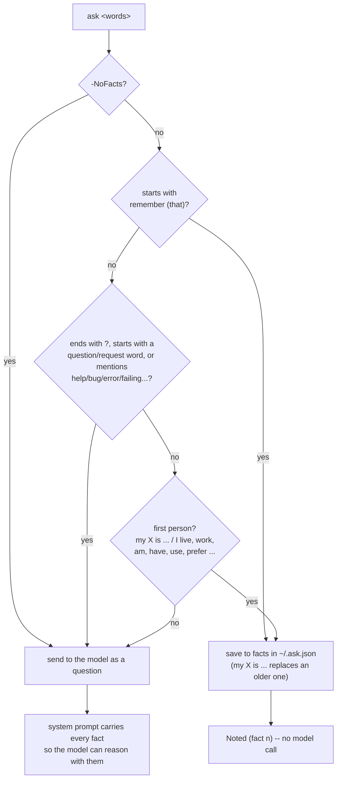
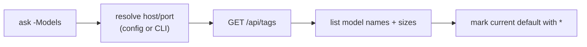
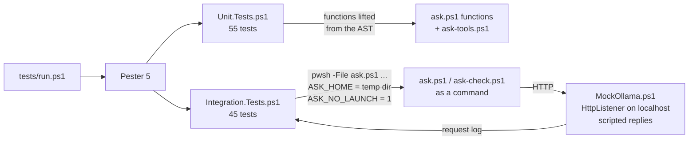

# Architecture

## Request lifecycle

## Config resolution

Every setting follows the same CLI-overrides-config-overrides-default chain:

## Model capabilities and tools

`ask.ps1` always uses `/api/chat`. It asks `/api/show` for the model's capabilities (cached for a day in `~/.ask_model_cache.json`) to catch a missing or non-text model early and to decide how tools are offered. Tools are off unless `-Tools` or `"tools": true`; then `tools_model` is used if set, and the loop in `ask-tools.ps1` takes over:

## Conversation history

By default, `ask` remembers the conversation. Each call appends your question and the model's reply to `~/.ask_conversation_state.json`, capped at the last 20 exchanges (40 messages), and prepends that history to the next request. Turns are sent to `/api/chat` with their real roles, so the model treats earlier questions as answered and replies only to the latest; re-asking a question drops its earlier exchange. After `history_idle_minutes` (default 30) without a question, the next one starts a fresh thread. Set `"history": false` in `~/.ask.json` to disable history by default.

## Model resolution

`-Model` is a switch, so a bare `ask -model` can show the current model. When there is a question, the override tag is its first or last word, checked against `/api/tags`:

## Server check

`ask-check.ps1` just runs `ask.ps1 -Check`, so `ask-check` and `ask --check` share one implementation:

## Facts

Statements are caught locally before any model call and saved to `facts` in `~/.ask.json`; questions get every fact in their system prompt:

## Model listing

`-Models` queries `/api/tags` directly using the same host/port resolution as a normal request, and marks the current configured default:

## Tests

`tests/run.ps1` runs 100 Pester tests: unit tests on functions lifted out of `ask.ps1`'s AST, and integration tests that run `ask.ps1` as a command against a scripted fake Ollama, each in its own `ASK_HOME`:

## Related

- [Overview](.) — install, usage, parameters
